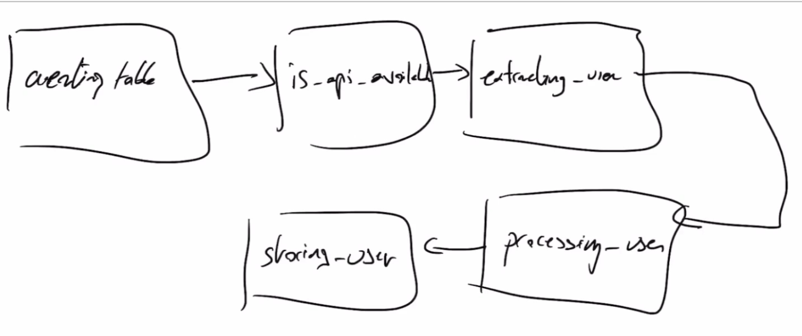

## Section 03



### Update DAGs
Remember to copy over the files to `~/airflow/dags`, e.g., `cp user_processing ~/airflow/dags`
### Providers

Additional providers
- SQLite Provider, required for `SqliteOperator`: `pip install 'apache-airflow-providers-sqlite'`
- Http operator, requried for `SimpleHTTPOperator`: `pip install 'apache-airflow-providers-http'`

To use these operators use `airflow.providers`, e.g.
```
from airflow.providers.sqlite.operators.sqlite import SqliteOperator
from airflow.providers.http.sensors.http import HttpSensor
from airflow.providers.http.operators.http import SimpleHttpOperator
```

Note that `PythonOperator` or `BashOperator` is available by default and can be accessed from `airflow.operators` directly (without `providers`).

List all providers:
```
airflow providers list
## package_name                    | description                                                                 | version
## ================================+=============================================================================+========
## apache-airflow-providers-ftp    | File Transfer Protocol (FTP) https://tools.ietf.org/html/rfc114             | 1.1.0  
## apache-airflow-providers-http   | Hypertext Transfer Protocol (HTTP) https://www.w3.org/Protocols/            | 2.0.1  
## apache-airflow-providers-imap   | Internet Message Access Protocol (IMAP) https://tools.ietf.org/html/rfc3501 | 1.0.1  
## apache-airflow-providers-sqlite | SQLite https://www.sqlite.org/                                              | 1.0.2 
```

### Airflow Test
It is recommended to test a task after creating it.

###### Example: Create a user table
Test a specific task without checking for dependencies or storing metadata using `airflow tasks test <dag-id> <task-id> <execution-date`, where the `execution-date` is a date from the past, e.g.
```
airflow tasks test user_processing creating_table 2021-01-01
```
The above task creates a table in SQLite. To check the table run
```
sqlite3 ~/airflow/airflow.db
```
Then run `.tables` to list all tables. There you will see a table named `users` has been created. Run
```
SELECT sql FROM sqlite_master 
WHERE tbl_name = 'users' AND type = 'table'
```
to get the query used to create the table.

To exit, hit `Ctrl+D`.


### Connections
List all connections
```
airflow connections list
```

`sqlite_default` is the default sqlite connection. View the details
```
airflow connections get sqlite_default
## id | conn_id   | conn_type | descripti | host      | schema | login | password | port | is_encryp | is_extra_e | extra_dej | get_uri    
##    |           |           | on        |           |        |       |          |      | ted       | ncrypted   | son       |            
## ===+===========+===========+===========+===========+========+=======+==========+======+===========+============+===========+============
## 41 | sqlite_de | sqlite    | None      | /tmp/sqli | None   | None  | None     | None | False     | False      | {}        | sqlite://%2
##    | fault     |           |           | te_defaul |        |       |          |      |           |            |           | Ftmp%2Fsqli
##    |           |           |           | t.db      |        |       |          |      |           |            |           | te_default.
##    |           |           |           |           |        |       |          |      |           |            |           | db   
```

Create a new connection named `db_sqlite`
```
airflow connections add db_sqlite \
    --conn-type sqlite \
    --conn-host ~/airflow/airflow.db
```

The newly created connection can be seen in UI: `Admin > Connections` or run `airflow connections get db_sqlite`
```
id | conn_id   | conn_type | descripti | host      | schema | login | password | port | is_encryp | is_extra_e | extra_dej | get_uri    
   |           |           | on        |           |        |       |          |      | ted       | ncrypted   | son       |            
===+===========+===========+===========+===========+========+=======+==========+======+===========+============+===========+============
50 | db_sqlite | sqlite    | None      | /home/air | None   | None  | None     | None | False     | False      | {}        | sqlite://%2
   |           |           |           | flow/airf |        |       |          |      |           |            |           | Fhome%2Fair
   |           |           |           | low/airfl |        |       |          |      |           |            |           | flow%2Fairf
   |           |           |           | ow.db     |        |       |          |      |           |            |           | low%2Fairfl
   |           |           |           |           |        |       |          |      |           |            |           | ow.db
```

Create a HTTP connection named `user_api`
```
airflow connections add user_api \
    --conn-type http \
    --conn-description "API for getting users" \
    --conn-host https://randomuser.me/
```

### Xcom
Xcom is a way to share data between tasks in Airflow. The `extracting_user` will create an Xcom so that the user will be stored as an Xcom in the database as a key-value pair. 

Once the Xcom has been stored in the metastore of Airflow, you can use `xcom_pull` method to fetch the data in your function.