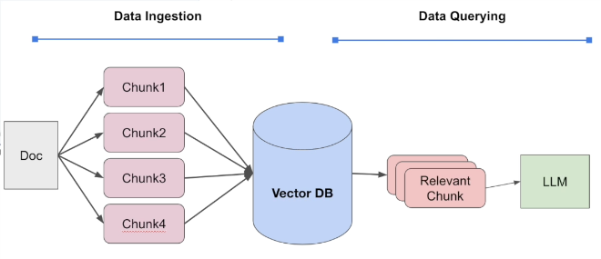

Udemy Course:
LlamaIndex - Develop LLM powered applications with LlamaIndex by Eden Marco



### Update requirements.txt

```
pip list --format=freeze > requirements.txt
```

### ENV variables

The following are defined as development environment variables:

```
OPENAI_API_KEY
PINECONE_API_KEY
PINECONE_HOST
```

Rest are present in the `.env` file.

### Refs:

- https://colab.research.google.com/drive/19xBNmejiJUhWIy71bWFnlL1H-O-hjTbW?usp=sharing
- https://github.com/karan-nanonets/llamaindex-guide
- https://nanonets.com/blog/llamaindex/
- https://github.com/openai/openai-cookbook/blob/main/examples/api_request_parallel_processor.py
- https://cookbook.openai.com/examples/how_to_handle_rate_limits
